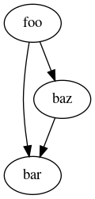

# SpyC - another C/C++ static analyzer

SpyC is an application which main purpose is to help developer
analyze complex C codebase. Its very first version allows to
scan C code looking for function definitions and calls and output
results as a digraph in dot format.

## Building

### Prerequisites

In order to build SpyC, you need to install first:
 * GNU/make
 * C++ compiler (`clang++` recommended)
 * LLVM and clang development libraries (version `8.0`)
 * libraries: ncurses, zlib

On Ubuntu 19.04 run:
```bash
$ sudo apt install build-essential make clang-8 libclang-8-dev llvm-8-dev ncurses-dev libz-dev
```

### Building with make

To build project clone repo and run:
```bash
$ make -r -R -j
```
It will create `spyc` binary in the `build` subdirectory.

### Customizing make

Following environmental variables changes `make` default behavior:
 * `BUILD_TYPE=debug` - build development version (`build/spyc-debug`)
 * `CLANG_SYSROOT` - change clang installation root directory to build against custom clang version

### Build targets

Following phony targets are available:
 * `app` - build SpyC application
 * `clean` - remove build objects
 * `distclean` - delete all artifacts (remove build directory)
 * `test` - run unit tests
 * `coverage` - generate coverage report
 * `all` - build everything

### Known issues with build system

When building with clang, `lcov` will fail to generate coverage report because it expects different format of data emitted by a compiler.

## Running

SpyC uses same invocation like other LLVM tools. Basic usage:
```bash
$ spyc <soucefile> -- 
```
It is possible to process multiple source files at once:
```bash
$ spyc <soucefile1> <sourcefile2> ... <sourcefileN> -- 
```
To add compiler flags specify them after `--` or use a compilation database file:
```bash
$ spyc <sourcefile> -- -I /usr/local/include
$ spyc <sourcefile> compilation_database.json
```

### Example

Generate and display callgraph in PNG format (`graphviz` is required):
```bash
$ ./build/spyc test/basic.c -- | dot -Tpng > basic.png && eog basic.png
```

